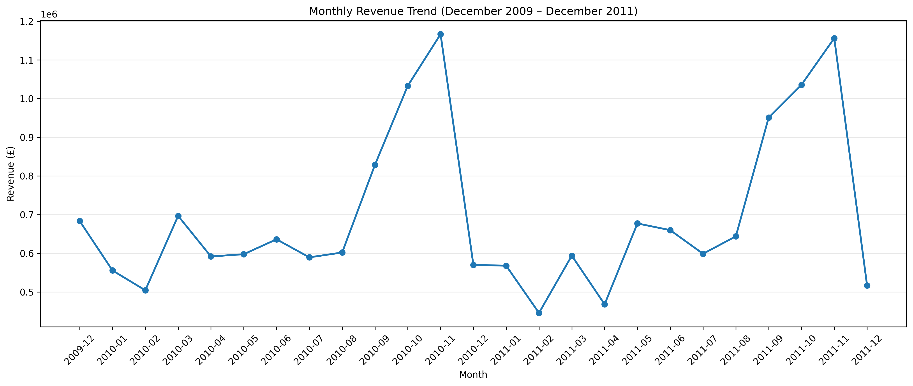
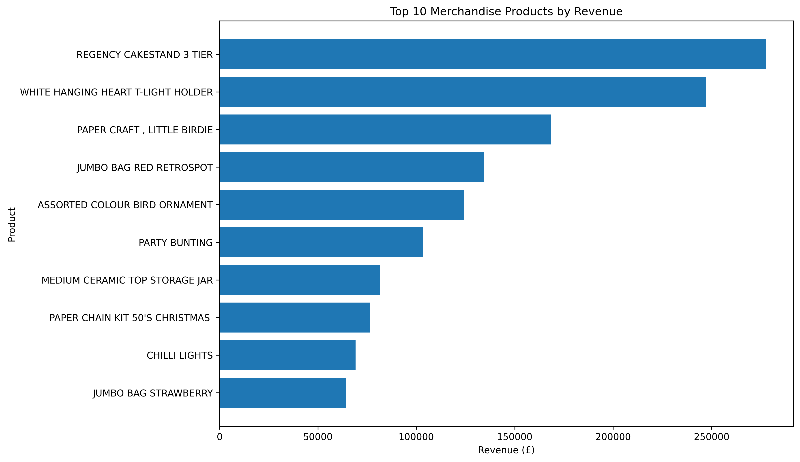
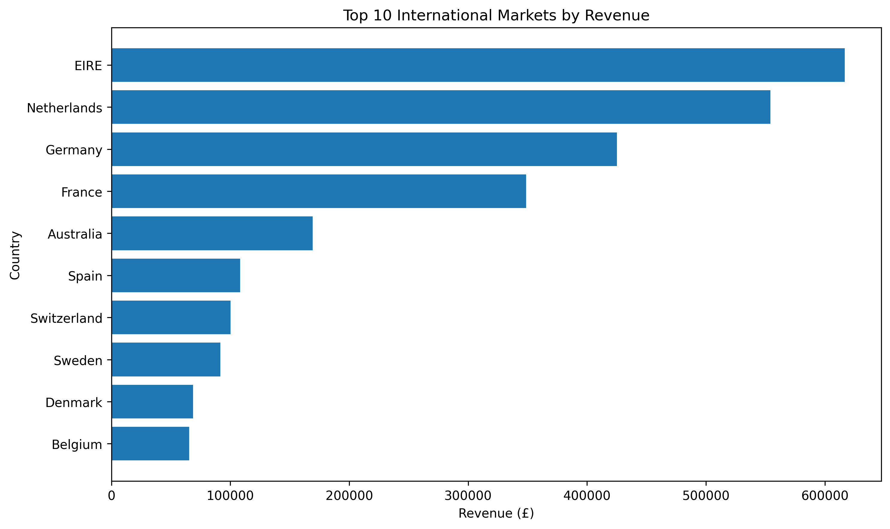
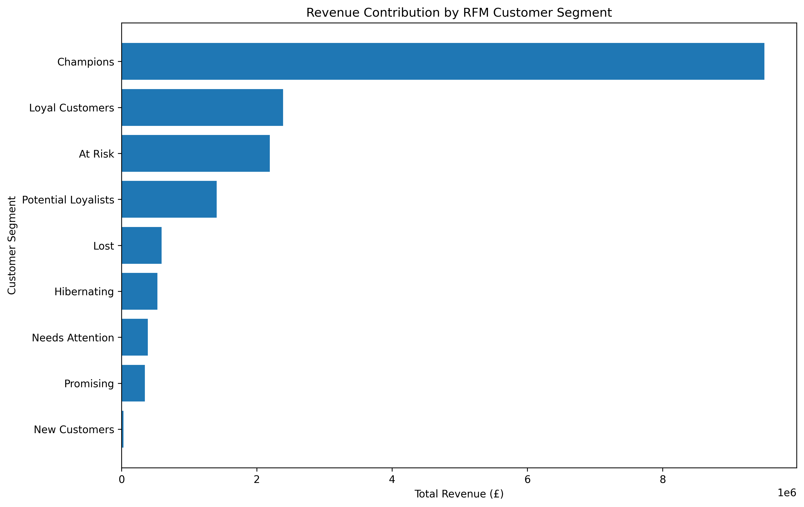
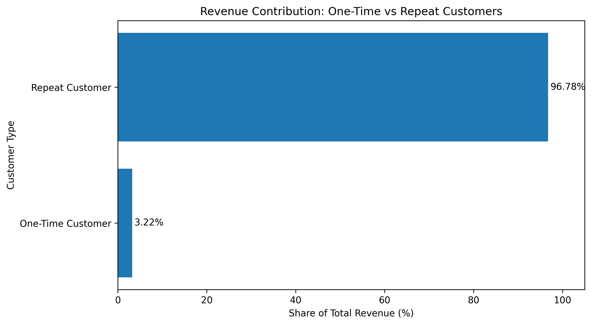

# Online Retail Customer Segmentation & Sales Analysis

## Project Overview

This project analyses over **1.06 million online retail transaction records** covering the period from **December 2009 to December 2011**.

The objective was to transform raw transactional data into actionable business insights by analysing:

- Sales performance and revenue trends
- Product performance
- Geographic market performance
- Customer purchasing behaviour
- High-value customers
- Customer revenue concentration
- RFM customer segmentation
- Repeat purchasing behaviour
- Customer retention opportunities

The project combines **Python and SQL** to demonstrate an end-to-end data analysis workflow, from data cleaning and exploratory analysis through to customer segmentation and business recommendations.

---

## Tools & Technologies

### Python
- Pandas
- NumPy
- Matplotlib
- Datetime analysis
- Data cleaning and transformation
- Customer-level feature engineering
- RFM segmentation

### SQL
- SQLite
- SELECT, WHERE and GROUP BY
- Aggregate functions
- DISTINCT
- Common Table Expressions (CTEs)
- Window functions
- RANK()

### Environment
- Google Colab
- Jupyter Notebook
- GitHub

---

## Dataset

The analysis uses the **Online Retail II** dataset, containing transactional data from a UK-based online retailer.

The original dataset contained:

- **1,067,371 transaction rows**
- 8 variables
- Transactions from **1 December 2009 to 9 December 2011**
- Customers across multiple international markets

The two worksheets covering **2009–2010** and **2010–2011** were combined into a single dataset before analysis.

---

## Data Cleaning

Before conducting the analysis, the dataset was investigated for missing values, duplicates, cancellations and invalid transaction values.

The cleaning process included:

- Combining both yearly worksheets
- Removing duplicate rows
- Removing cancelled transactions
- Removing transactions with non-positive quantities
- Removing transactions with non-positive prices
- Removing records without identifiable Customer IDs
- Removing records with missing product descriptions
- Creating revenue and time-based analytical features

### Cleaning Results

| Metric | Result |
|---|---:|
| Original Rows | 1,067,371 |
| Cleaned Rows | 779,425 |
| Rows Removed | 287,946 |
| Missing Values Remaining | 0 |
| Duplicate Rows Remaining | 0 |
| Cancelled Invoices Remaining | 0 |

---

## Sales Performance Overview

After cleaning, the retailer generated:

| KPI | Result |
|---|---:|
| Total Revenue | **£17,374,804.27** |
| Total Orders | **36,969** |
| Unique Customers | **5,878** |
| Unique Products | **4,631** |
| Countries Served | **41** |
| Average Order Value | **£469.98** |

---

## Monthly Revenue Analysis

Sales demonstrated a clear seasonal pattern, with particularly strong revenue during the final months of the year.

**November 2010** was the highest-revenue month, generating approximately **£1.17 million**.

November 2011 followed closely at approximately **£1.16 million**.

The recurring increase across **September, October and November** suggests strong year-end seasonal demand.



### Business Insight

The retailer should prepare inventory, marketing activity and operational capacity ahead of the September–November period to take advantage of increased seasonal demand.

---

## Product Performance

Product-level analysis was conducted using revenue, units sold and order frequency.

Operational stock codes such as postage and manual adjustments were separated from merchandise analysis to avoid treating non-product records as normal merchandise performance.

Among the strongest merchandise products were:

- **REGENCY CAKESTAND 3 TIER**
- **WHITE HANGING HEART T-LIGHT HOLDER**
- **JUMBO BAG RED RETROSPOT**
- **ASSORTED COLOUR BIRD ORNAMENT**
- **PARTY BUNTING**



The analysis also identified unusually large individual transactions. These were retained where there was insufficient evidence to classify them as erroneous, but they were considered carefully when interpreting product and customer performance.

---

## Geographic Market Analysis

The retailer was highly dependent on its domestic market.

The **United Kingdom generated approximately 82.82% of total revenue**.

To better understand overseas performance, international markets were analysed separately.

The strongest international markets included:

- EIRE
- Netherlands
- Germany
- France
- Australia



### International Market Insights

**EIRE** generated approximately **£616,571** in revenue but had only **5 identifiable customers**, indicating significant customer concentration.

The **Netherlands** generated approximately **£554,038** from 228 orders and recorded an average order value of approximately **£2,429.99**.

Germany and France had broader customer bases and higher order volumes, suggesting a more diversified market structure.

### Business Insight

International expansion decisions should consider not only total revenue but also customer concentration, order volume and average order value.

---

## Customer Behaviour Analysis

Customer-level metrics were created to analyse:

- Total customer revenue
- Number of orders
- Total units purchased
- Average order value

The typical customer generated considerably less revenue than the retailer's highest-value customers.

| Customer Metric | Median |
|---|---:|
| Total Revenue | **£867.74** |
| Number of Orders | **3** |
| Average Order Value | **£279.24** |

Customer revenue was concentrated among the highest-value customers:

- **Top 10 customers:** 16.04% of customer revenue
- **Top 100 customers:** 37.55% of customer revenue

This demonstrates the importance of identifying and retaining commercially valuable customers.

---

## SQL Business Analysis

The cleaned transactional dataset was loaded into an **SQLite database** to perform additional business analysis using SQL.

SQL was used to:

- Rank monthly revenue
- Analyse international market performance
- Calculate average order values
- Aggregate customer purchasing behaviour
- Rank high-value customers
- Apply Common Table Expressions
- Use SQL window functions

### Example SQL Query

```sql
WITH customer_value AS (
    SELECT
        "Customer ID" AS customer_id,
        ROUND(SUM(Revenue), 2) AS total_revenue,
        COUNT(DISTINCT Invoice) AS total_orders,
        ROUND(
            SUM(Revenue) / COUNT(DISTINCT Invoice),
            2
        ) AS average_order_value
    FROM sales
    GROUP BY "Customer ID"
)

SELECT
    customer_id,
    total_revenue,
    total_orders,
    average_order_value,
    RANK() OVER (
        ORDER BY total_revenue DESC
    ) AS customer_rank
FROM customer_value
ORDER BY customer_rank
LIMIT 10;
```

The SQL results were consistent with the Python analysis and provided additional evidence of customer and market concentration.

---

## RFM Customer Segmentation

RFM analysis was used to segment customers based on three dimensions:

- **Recency (R):** How recently the customer purchased
- **Frequency (F):** How frequently the customer purchased
- **Monetary (M):** How much revenue the customer generated

Customers were assigned quartile-based scores from **1 to 4**.

For Recency, lower values received higher scores because a more recent purchase represents stronger engagement.

For Frequency and Monetary value, higher values received higher scores.

Customers were then classified into business-friendly segments including:

- Champions
- Loyal Customers
- Potential Loyalists
- New Customers
- Promising
- Needs Attention
- At Risk
- Hibernating
- Lost

---

## RFM Segment Performance

The segmentation revealed substantial differences in commercial value across customer groups.

### Champions

**758 customers** were classified as Champions.

Although they represented only **12.90% of customers**, they generated approximately:

**£9.51 million — 54.71% of customer revenue.**

Champions averaged approximately:

- **22.36 orders**
- **£12,539.90 revenue per customer**
- **10 days since their most recent purchase**

### Loyal Customers

Loyal Customers generated a further:

**£2.39 million — 13.75% of revenue.**

Together, **Champions and Loyal Customers generated approximately 68.46% of customer revenue**.

### At Risk Customers

The analysis identified **888 At Risk customers**.

They generated approximately:

**£2.19 million — 12.62% of customer revenue.**

However, their average recency was approximately **275 days**, indicating that customers with meaningful historical purchasing activity had become inactive.



### Business Insight

The At Risk segment represents a particularly important win-back opportunity because these customers have demonstrated substantial historical value but reduced recent engagement.

---

## Repeat Customer Analysis

Customers were classified according to whether they completed one order or returned for additional purchases.

| Customer Type | Customers | Customer Share | Revenue Share |
|---|---:|---:|---:|
| One-Time Customer | 1,623 | 27.61% | 3.22% |
| Repeat Customer | 4,255 | 72.39% | **96.78%** |

Repeat customers generated approximately **£16.81 million**, compared with approximately **£560,273** from one-time customers.



### Key Insight

Repeat customers represent **72.39% of customers but generate 96.78% of revenue**.

This provides strong evidence that customer retention and repeat purchasing are fundamental drivers of the retailer's financial performance.

---

## Key Business Findings

The analysis identified several commercially important findings:

**1. Strong seasonal demand**

Revenue increases substantially during September–November, suggesting the business should prepare inventory and marketing activity ahead of the year-end peak.

**2. Heavy dependence on the UK**

Approximately **82.82% of revenue** originates from the UK market.

**3. High-value customers drive revenue**

Champions represent only **12.90% of customers but generate 54.71% of customer revenue**.

**4. Retention represents a major opportunity**

Champions and Loyal Customers together generate approximately **68.46% of customer revenue**.

**5. At Risk customers remain commercially important**

The At Risk segment historically generated approximately **£2.19 million**, making targeted re-engagement potentially valuable.

**6. Repeat purchasing is critical**

Repeat customers generate **96.78% of revenue**, demonstrating the importance of converting first-time customers into returning customers.

---

## Business Recommendations

Based on the analysis, the retailer could:

1. **Prioritise retention of Champions and Loyal Customers** through loyalty rewards, personalised recommendations, VIP benefits and early product access.

2. **Develop targeted win-back campaigns for At Risk customers**, prioritising customers with strong historical spending and purchasing frequency.

3. **Convert first-time customers into repeat buyers** through second-purchase incentives, post-purchase communication and personalised product recommendations.

4. **Prepare inventory and marketing campaigns ahead of September–November** to capitalise on recurring seasonal demand.

5. **Protect the core UK market while evaluating international growth opportunities** based on revenue, customer concentration, order frequency and average order value.

6. **Monitor extreme transactions separately** to prevent unusually large purchases from distorting standard customer and product performance reporting.

---

## Limitations

Several limitations should be considered when interpreting the findings:

- The dataset covers the historical period from December 2009 to December 2011 and should not be interpreted as representing current retail trends.
- December 2011 contains only partial-month data because the final transaction occurred on 9 December.
- Transactions without Customer IDs were excluded from customer-level analysis.
- Cancelled transactions, returns, duplicates and non-positive sales records were excluded from the primary completed-sales analysis.
- Some unusually large transactions were retained where there was insufficient evidence to classify them as erroneous.
- RFM segmentation uses relative quartile-based scoring, meaning segment classifications are specific to this customer population.
- The dataset does not contain product costs, marketing channels or customer demographic information, preventing direct profitability or acquisition-channel analysis.

---

## Skills Demonstrated

This project demonstrates:

- **Python data analysis**
- **SQL querying**
- **Data cleaning**
- **Exploratory data analysis**
- **Data transformation**
- **KPI development**
- **Time-series analysis**
- **Customer behaviour analysis**
- **RFM segmentation**
- **Customer retention analysis**
- **Data visualisation**
- **Business insight generation**
- **Business recommendations**

---

## Repository Contents

```text
Online-Retail-Customer-Segmentation-Sales-Analysis/
│
├── Online_Retail_Customer_Segmentation_Sales_Analysis.ipynb
├── monthly_revenue_trend.png
├── top_10_products_revenue.png
├── top_10_international_markets.png
├── rfm_segment_revenue.png
├── repeat_customer_revenue.png
└── README.md
```

---

## Conclusion

This project demonstrates an end-to-end analytical workflow using **Python and SQL** to transform more than one million raw retail transaction records into actionable business insights.

---

## 📊 Power BI Dashboard

An interactive Power BI dashboard was developed to transform the analysis into clear, business-focused insights. The report contains two dashboard pages covering overall sales performance and customer behaviour.

### Sales Overview

The Sales Overview dashboard tracks key commercial KPIs and highlights revenue trends across products, countries and time.

**Key KPIs**
- Total Revenue: £17.37M
- Total Customers: 5,878
- Total Orders: 36,969
- Average Order Value: £469.98

**Visualisations**
- Monthly Revenue Trend
- Top 10 Countries by Revenue
- Top 10 Products by Revenue

### Customer & Geographic Analysis

The second dashboard focuses on customer value, retention and geographic distribution.

**Key KPIs**
- Total Customers: 5,878
- Revenue per Customer: £2.96K
- Repeat Customer Rate: 72.39%
- Average Orders per Customer: 6.29

**Visualisations**
- Top 10 Countries by Customers
- Top 10 Customers by Revenue

### Dashboard Preview

The strongest finding is the importance of **customer retention**. Repeat customers generated **96.78% of revenue**, while Champions and Loyal Customers accounted for approximately **68.46% of customer revenue**.

The analysis suggests that retaining high-value customers, re-engaging At Risk customers and converting first-time purchasers into repeat buyers could provide significant commercial value.
